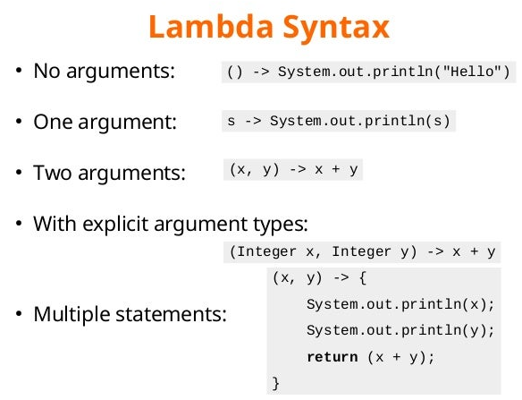
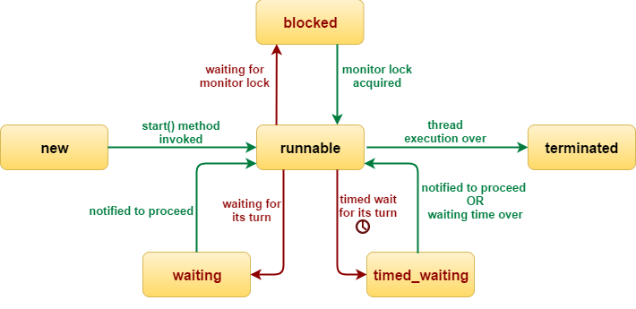

# Java Trial Session

> This is a Java free trial session covering introduction to lambdas and concurrency.

Tools used:

- JDK 11
- Maven
- JUnit 5, Mockito
- IntelliJ IDE

## Table of contents

1. Introduction to Lambdas
    - Lambda Expressions and Functional Interfaces
    - Exploring `java.util.function` package
    - Lambdas vs Anonymous classes
    - Chaining and Composing Lambdas
2. Introduction to Concurrency
    - Threading fundamentals
    - Thread coordination

---

### Chapter 01. Introduction to Lambdas

#### Lambda Expressions and Functional Interfaces

Lambda expressions basically express instances of **functional interfaces**.

What is a **Functional interface**?

An interface with **single** abstract method is called functional interface.

- `default` and `static` methods in interface do **NOT** count.
- methods from `java.lang.Object` do **NOT** count (`equals()`, `toString()`, `hashCode()`, etc.)

An example is `java.lang.Runnable`.

```java
package java.lang;

@FunctionalInterface
public interface Runnable {
    void run();
}
```

Lambda expressions implement the only abstract function and therefore implement functional interfaces.

Lambda expressions are added in Java 8 and provide below functionalities:

- Enable to treat functionality as a **method argument**, or code as **data**.
- A function that can be created without belonging to any class.
- A lambda expression can be passed around as if it was an object and executed on demand.

**Example:**

Implement a functional interface.

```java

@FunctionalInterface
public interface Supplier<T> {
    T get();
}
```

```
Supplier<String> supplier = () -> "Hello Students!!";
```

Complete source code:

```java
import java.util.function.Supplier;

public class LambdaDemo {

    public static void main(final String[] args) {
        final Supplier<String> supplier = () -> "Hello Students!!";
        System.out.println(supplier.get());
    }

}
```

Output:

```
Hello Students!!
```

Another example using **Consumer**:

```java

@FunctionalInterface
public interface Consumer<T> {
    void accept(T t);

    default Consumer<T> andThen(final Consumer<? super T> after) {
        Objects.requireNonNull(after);
        return (T t) -> {
            accept(t);
            after.accept(t);
        };
    }
}
```

Complete source code:

```java
import java.util.Locale;
import java.util.function.Consumer;
import java.util.function.Supplier;

public class LambdaDemo {

    public static void main(final String[] args) {
        // Supplier
        final Supplier<String> supplier = () -> "Hello Students!!";
        System.out.println(supplier.get());

        // Consumer
        final Consumer<String> consumer = (String s) -> { // need to put in curly braces if more than 1 statements
            System.out.println(s.toUpperCase(Locale.ROOT));
            System.out.println(s.toLowerCase(Locale.ROOT));
        };
        consumer.accept(supplier.get());
    }

}
```

Output:

```
Hello Students!!
HELLO STUDENTS!!
hello students!!
```



#### Exploring `java.util.function` package

JDK has more than 40 interfaces in `java.util.function` package organized in 4 categories:

- Supplier
- Consumer
- Predicate
- Function

#### Supplier

The `Supplier`

- does not take any argument
- produces a value

```java
public interface Supplier<T> {
    T get();
}
```

```
Supplier<String> supplier = () -> "Hello";
```

#### Consumer

The `Consumer`

- takes any argument
- does not return anything

```java
public interface Consumer<T> {
    void accept(T t);
}
```

```
Consumer<String> consumer = s -> System.out.println(s);
```

#### Predicate

The `Predicate`

- takes any argument
- returns a **boolean**

Used to filter data.

```java
public interface Predicate<T> {
    boolean test(T t);
}
```

```
Predicate<String> isEmpty = s -> s.isEmpty();
```

#### Function

The `Function`

- takes any argument
- returns any type

Used to map data.

```java
public interface Function<T, R> {
    R apply(T t);
}
```

```
Function<Student, String> getStudentId = student -> student.getId();
```

#### Runnable

Although `Runnable` interface lies in `java.lang` package, it is still a functional interface. Thus, any interface which
has ONLY ONE abstract method is always a functional interface and annotating with `@FunctionalInterface` is optional.

The `Runnable`

- does not take any argument
- does not return anything

Used for defining thread task.

```java
public interface Runnable {
    void run();
}
```

```
Runnable runMe = () -> System.out.println("I am running in a separate thread");
```

#### Interview Problem 1 (Societe Generale): Demonstrate functional interfaces in code

Given a **Java POJO**:

```java
public class Student {

    private String name;
    private int age;

    public Student(final String name, final int age) {
        this.name = name;
        this.age = age;
    }

    public String getName() {
        return name;
    }

    public void setName(final String name) {
        this.name = name;
    }

    public int getAge() {
        return age;
    }

    public void setAge(final int age) {
        this.age = age;
    }

    @Override
    public String toString() {
        return "Student{" +
                "name='" + name + '\'' +
                ", age=" + age +
                '}';
    }

}
```

1. Print all students using `Consumer`
2. Print all students names using `Function` and `Consumer`
3. Print all students names starting with **'T'** using `Predicate` and `Consumer`

**Solution**:

```java
import java.util.ArrayList;
import java.util.List;
import java.util.function.Function;
import java.util.function.Predicate;

public class FunctionalInterfacesDemo {

    public static void main(final String[] args) {
        final var john = new Student("John", 18);
        final var mary = new Student("Mary", 16);
        final var thomas = new Student("Thomas", 21);
        final var rahul = new Student("Rahul", 23);
        final var jenny = new Student("Jenny", 17);
        final var tatiana = new Student("Tatiana", 25);

        final var students = List.of(john, mary, thomas, rahul, jenny, tatiana);
        System.out.println("1. Print all students using Consumer~>");
        // Consumer
        students.forEach(student -> System.out.println(student));
        System.out.println("----------------------");

        final List<String> names = new ArrayList<>();

        // Function
        final Function<Student, String> toName = (Student student) -> student.getName();

        // Consumer
        students.forEach(student -> {
            final String name = toName.apply(student); // Function mapping
            names.add(name);
        });

        System.out.println("2. Print all students names using Function and Consumer~>");
        names.forEach(name -> System.out.println(name));
        System.out.println("----------------------");

        // Predicate
        final Predicate<String> startsWithT = name -> !name.startsWith("T");
        names.removeIf(startsWithT);
        // OR,
        // names.removeIf(name -> !name.startsWith("T")); // inline

        System.out.println("3. Print all students names starting with 'T' using Predicate and Consumer~>");
        // Consumer
        names.forEach(name -> System.out.println(name));
        System.out.println("----------------------");
    }

}
```

**Output**:

```
1. Print all students using Consumer~>
Student{name='John', age=18}
Student{name='Mary', age=16}
Student{name='Thomas', age=21}
Student{name='Rahul', age=23}
Student{name='Jenny', age=17}
Student{name='Tatiana', age=25}
----------------------
2. Print all students names using Function and Consumer~>
John
Mary
Thomas
Rahul
Jenny
Tatiana
----------------------
3. Print all students names starting with 'T' using Predicate and Consumer~>
Thomas
Tatiana
----------------------
```

#### Lambdas vs Anonymous classes

Prior to Java 8, the primary means of creating a **function object** was the **anonymous class**.

Code Snippet to sort a list of strings in order of length using an anonymous class to create the sort's comparison
function (which imposes the sort order):

```
        Collections.sort(words, new Comparator<String>() {
            @Override
            public int compare(final String s1, final String s2) {
                return Integer.compare(s1.length(), s2.length());
            }
        });
```

Lambdas are similar in function to anonymous class, but far more concise.

```
        Collections.sort(words, (s1, s2) -> Integer.compare(s1.length(), s2.length()));
        // OR
        Collections.sort(words, Comparator.comparingInt(String::length));
        // OR
        words.sort(Comparator.comparingInt(String::length));
```

The most important difference is in the **performance** => lambdas are more than **60 times faster** than anonymous
classes!

The reason is the way the Java compiler compiles the lambdas versus the anonymous classes.

Java compiler uses a special `invokedynamic` call to compile lambdas and thus the compiled code is different and much
faster.

Other reason is automatic **"boxing"** and **"unboxing"** of primitives and their wrapper classes.

For ex:

```
        Comparator<Integer> cmp = (i1, i2) -> Integer.compare(i1, i2);
        int compared = cmp.compare(5, 10);
```

Comparator interface:

```java
public interface Comparator<T> {
    int compare(T o1, T o2);
}
```

So above code will be interpreted as when we call compare method: `int compared = cmp.compare(5, 10);`

```java
public interface Comparator<Integer> {
    int compare(Integer o1, Integer o2);
}
```

Firstly, **boxing** will be done to promote primitive `int` 5 and 10 to `Integer`.

After the comparison, resulting `Integer` (a negative integer, zero, or a positive integer as the first argument is less
than, equal to, or greater than the second) will be converted back or **unboxed** to primitive `int`.

If this code is called on millions of integers => this will badly impact the performance.

Thus, to overcome this - a set of functional interfaces are added for primitive types which can be used by lambdas, for
ex:

- `IntPredicate`
- `LongSupplier`
- `IntFunction<T>`
- `LongToIntFunction`

Just taking an example again, in the `Supplier` interface, we have a generic type `T` returned via `get()` method.

```java
public interface Supplier<T> {
    T get();
}
```

However, for `LongSupplier` interface, we can directly get primitive `long` via `getAsLong()` method as return value
without any need to **box** it to wrapper `Long`.

```java
public interface LongSupplier {
    long getAsLong();
}
```

Similarly, for `DoubleToIntFunction` interface, we can directly work with primitives to create the function to
convert `double` to `int`.

```java
public interface DoubleToIntFunction {
    int applyAsInt(double value);
}
```

Complete Java code example to illustrate this:

```java
import java.util.function.DoubleToIntFunction;
import java.util.function.LongSupplier;

public class PrimitiveLambdas {

    public static void main(final String[] args) {
        final LongSupplier supplier = () -> 10L;
        final long i = supplier.getAsLong();
        System.out.printf("i = %d%n", i);

        final DoubleToIntFunction function = value -> (int) Math.ceil(value);
        final int pi = function.applyAsInt(Math.PI);
        System.out.printf("PI = %d%n", pi);
    }

}
```

**Output**:

```
i = 10
PI = 4
```

#### Chaining and Composing Lambdas

We can create new lambdas by combining existing lambdas:

- Predicate
- Consumer
- Function

We can also modify lambdas. All the above added functionalities are possible because of `default` or `static` methods
defined in the functional interfaces. And, there is still **only one** abstract method.

**Example source code**:

```java
import java.util.Locale;
import java.util.function.Consumer;
import java.util.function.Predicate;

public class ChainingLambdas {

    public static void main(final String[] args) {
        // Predicate
        final Predicate<String> isNull = s -> s == null;
        System.out.println("Using 'isNull' Predicate~>");
        System.out.printf("For null = %b%n", isNull.test(null));
        System.out.printf("For 'Hello Students' = %b%n", isNull.test("Hello Students"));
        System.out.println("------------------------");

        final Predicate<String> isEmpty = s -> s.isEmpty();
        System.out.println("Using 'isEmpty' Predicate~>");
        System.out.printf("For empty = %b%n", isEmpty.test(""));
        System.out.printf("For 'Hello Students' = %b%n", isEmpty.test("Hello Students"));
        System.out.println("------------------------");

        final Predicate<String> isNotNullOrEmpty = isNull.negate().and(isEmpty.negate()); // combine
        System.out.println("Using 'isNotNullOrEmpty' Predicate~>");
        System.out.printf("For null = %b%n", isNotNullOrEmpty.test(null));
        System.out.printf("For empty = %b%n", isNotNullOrEmpty.test(""));
        System.out.printf("For 'Hello Students' = %b%n", isNotNullOrEmpty.test("Hello Students"));
        System.out.println("------------------------");

        // Consumer
        final Consumer<String> c1 = s -> System.out.printf("c1 consumer prints as upper case: %s%n",
                                                           s.toUpperCase(Locale.ROOT));
        final Consumer<String> c2 = s -> System.out.printf("c2 consumer prints as lower case: %s%n",
                                                           s.toLowerCase(Locale.ROOT));

        final Consumer<String> c3 = c1.andThen(c2); // combine
        System.out.println("Using 'andThen' Consumer to combine~>");
        c3.accept("Hello Students");
        System.out.println("------------------------");
    }

}
```

**Output**:

```
Using 'isNull' Predicate~>
For null = true
For 'Hello Students' = false
------------------------
Using 'isEmpty' Predicate~>
For empty = true
For 'Hello Students' = false
------------------------
Using 'isNotNullOrEmpty' Predicate~>
For null = false
For empty = false
For 'Hello Students' = true
------------------------
Using 'andThen' Consumer to combine~>
c1 consumer prints as upper case: HELLO STUDENTS
c2 consumer prints as lower case: hello students
------------------------
```

#### Interview Problem 2 (Societe Generale - Follow up for Problem 1): Demonstrate combining lambdas

Given a POJO class:

```java
public class Student {

    private String name;
    private int age;

    public Student(final String name, final int age) {
        this.name = name;
        this.age = age;
    }

    public String getName() {
        return name;
    }

    public void setName(final String name) {
        this.name = name;
    }

    public int getAge() {
        return age;
    }

    public void setAge(final int age) {
        this.age = age;
    }

    @Override
    public String toString() {
        return "Student{" +
                "name='" + name + '\'' +
                ", age=" + age +
                '}';
    }

}
```

- Sort student names as natural ordering and print
- Sort student names as its length and print
- Sort students by 'Name' and then 'Age' in descending order and print

**Solution**:

```java
import java.util.ArrayList;
import java.util.Arrays;
import java.util.Comparator;
import java.util.List;
import java.util.function.Function;
import java.util.function.ToIntFunction;

public class CombiningLambdas {

    public static void main(final String[] args) {
        final var john = new Student("John", 18);
        final var mary = new Student("Mary", 16);
        final var thomas = new Student("Thomas", 21);
        final var rahul = new Student("Rahul", 23);
        final var jenny = new Student("Jenny", 17);
        final var tatiana = new Student("Tatiana", 25);
        final var john1 = new Student("John", 19);

        final var students = Arrays.asList(john, mary, thomas, rahul, jenny, tatiana, john1);

        final List<String> studentNames = new ArrayList<>();
        final Function<Student, String> toName = (Student student) -> student.getName();
        students.forEach(student -> {
            final String name = toName.apply(student); // Function mapping
            studentNames.add(name);
        });

        final Comparator<String> cmp = (s1, s2) -> s1.compareTo(s2);
        studentNames.sort(cmp);
        System.out.printf("Sorted student names as natural ordering: %s%n", studentNames);

        final ToIntFunction<String> toLength = s -> s.length(); // no boxing or unboxing done
        final Comparator<String> cmp2 = Comparator.comparingInt(toLength); // combining Comparator and Function
        studentNames.sort(cmp2);
        System.out.printf("Sorted student names as its length: %s%n", studentNames);
        System.out.println("-------------------------");

        // Comparators chaining and combining
        final Comparator<Student> cmpName = Comparator.comparing(user -> user.getName());
        final Comparator<Student> cmpAge = Comparator.comparing(user -> user.getAge());
        final Comparator<Student> cmpNameAndThenAge = cmpName.thenComparing(cmpAge);
        final Comparator<Student> reversed = cmpNameAndThenAge.reversed();

        students.sort(reversed);
        System.out.println("Printing Students sorted by 'Name' and then 'Age' in descending order~>");
        students.forEach(student -> System.out.println(student));
        System.out.println("-------------------------");
    }

}
```

**Output**:

```
Sorted student names as natural ordering: [Jenny, John, John, Mary, Rahul, Tatiana, Thomas]
Sorted student names as its length: [John, John, Mary, Jenny, Rahul, Thomas, Tatiana]
-------------------------
Printing Students sorted by 'Name' and then 'Age' in descending order~>
Student{name='Thomas', age=21}
Student{name='Tatiana', age=25}
Student{name='Rahul', age=23}
Student{name='Mary', age=16}
Student{name='John', age=19}
Student{name='John', age=18}
Student{name='Jenny', age=17}
-------------------------
```

---

This is just about the introduction to lambdas we have covered in this free trial session.

In the real module course - we will cover additional topics on lambdas:

- Streams and Parallel Streams
- Implementing Design Patterns using Lambdas
- Lambdas and Streams best practices

---

### Chapter 02. Introduction to Concurrency

#### Threading fundamentals

In computer science, **concurrency** is the execution of the multiple instruction sequences at the **same** time.

In more technical terms, **concurrency** is the ability of different parts or units of a program, algorithm, or problem
to be executed out-of-order or in partial order, without affecting the outcome. This allows for **parallel** execution
of the concurrent units, which can significantly improve overall speed of the execution in multiprocessor and multicore
systems. It may also refer to the _decomposability_ of a program, algorithm, or problem into order-independent or
partially-ordered components or units of computation.

- Case 1: CPU with only one core

CPU will be executing processes one by one, individually by **time slice**. A time slice is short time frame that gets
assigned to process for CPU execution.

- Case 2: CPU with multiple cores

Only on multicore CPU system, multiple processes execute at the **same** time on different cores.

**Scheduler**

CPU Scheduling is a process that allows one process to use the CPU while another process is delayed (in standby) due to
unavailability of any resources such as I/O etc., thus making full use of the CPU. Whenever the CPU becomes idle, the
operating system must select one of the processes in the line ready for launch. The selection process is done by a
temporary (CPU) scheduler. The Scheduler selects between memory processes ready to launch and assigns the CPU to one of
them.

Scheduler may **pause** a thread due to:

- The thread is waiting for some more data
- The thread is waiting for another thread to do something
- CPU should be shared equally among threads

**What is a Java Thread?**

We can define threads as a light-weight **subprocess** within the smallest unit of **processes** and having separate
paths of execution. These threads use shared memory, but they act independently. Hence, if there is an exception in a
thread, that will not affect the working of other threads despite them sharing the same memory.

Few points about Java Thread:

- Thread is a set of instructions defined at Operating System level
- Lightweight sub-process through which we can perform multiple activities within a single process
- An application can be composed of several threads => JVM itself works with several threads like GC, JIT, etc.
- Different threads can be executed at the **same** time on different cores or cpus

**Race Condition**

By definition, a race condition is a condition of a program where its behavior depends on relative timing or
interleaving of multiple threads or processes.

In simpler words, it means that two different threads are trying to **read** and **write** the **same** variable at
the **same** time.

#### Interview Problem 3 (Macquarie, Merrill Lynch): Demonstrate race condition in Singleton pattern and how to fix it

Given source code for Singleton pattern:

```java
public class SingletonDemo {

    private static SingletonDemo instance;

    private SingletonDemo() {
    }

    public static SingletonDemo getInstance() {
        if (instance == null) {
            instance = new SingletonDemo();
        }
        return instance;
    }

}
```

Explanation for **race condition**:

Suppose there are 2 threads `T1` and `T2` calling `getInstance()` method at the same time.

- `T1` thread gets CPU time and reaches at point: `if (instance == null)`
- The thread scheduler pauses `T1`
- `T2` thread gets CPU time and it passes this line of code and creates new instance: `instance = new SingletonDemo()`
- The thread scheduler pauses `T2`
- `T1` thread gets CPU time, and it resumes from `if (instance == null)` check: it will also create a new
  instance: `instance = new SingletonDemo()`; thus breaking the Singleton pattern contract.

**Solution**:

Use **synchronization**.

Synchronization prevents a block of code to be executed by more than one thread at the same time.

```java
public class SingletonDemo {

    private static SingletonDemo instance;

    private SingletonDemo() {
    }

    public static synchronized SingletonDemo getInstance() {
        if (instance == null) {
            instance = new SingletonDemo();
        }
        return instance;
    }

}
```

For synchronization to work, we need a synchronization object key also called as monitor or mutex - every Java object
can play as monitor or mutex.

In the `static` method context => Class object is synchronization object key

```
// SingletonDemo.class => synchronization object key
public static synchronized SingletonDemo getInstance() {
   ...
}
```

In the `non-static` method context => instance object is synchronization object key

```
// instance object which invokes this method is synchronization object key
public synchronized SingletonDemo getInstance() {
   ...
}
```

Or, we can also explicitly use a Java object as synchronization object key using **synchronized block**

```
// instance object used explicitly as synchronization object key in synchronized block
public SingletonDemo getInstance() {
   synchronized(this) {
     ...
   }
}
```

**Reentrant Lock**

Java locks are **reentrant** => when a thread holds a lock, it can enter a block synchronized on the lock it is holding.

```
public synchronized SingletonDemo getInstance() {
   ...
}

public synchronized void doSomething() {
   ...
}
```

A thread `T1` which has acquired instance lock by entering the `getInstance()` method can also enter `doSomething()`
method as the instance lock is same for both the methods. Any other thread can **not** acquire the instance lock and
enter these 2 methods as it's held by thread `T1`.

**Deadlock**

A deadlock is a situation where a thread `T1` holds a key needed by a thread `T2`, and `T2` holds the key needed by
`T1`. In this situation, both the threads will keep on waiting for each other indefinitely.

There is nothing we can do if the deadlock situation happens but to restart the JVM. However, even identifying a
deadlock is very complex in the modern JVMs or monitoring tools.

**How to create and run threads in Java?**

The most basic way is to:

- create a `Runnable` instance
- pass it to the `Thread` constructor
- invoke `start()` method on `Thread` object

**Example source code**:

```java
public class CreateThreadDemo {

    public static void main(final String[] args) {
        final Runnable runnable = () -> System.out.printf("I am running in this thread: %s%n",
                                                          Thread.currentThread().getName());
        final Thread thread = new Thread(runnable, "MyThread");
        thread.start();
    }

}
```

**Output**:

```
I am running in this thread: MyThread
```

#### Interview Problem 4 (JP Morgan Chase): Demonstrate synchronization issue and fix the code

Given Java Code:

```java
public class Counter {

    private long counter;

    public Counter(final long counter) {
        this.counter = counter;
    }

    public long getCounter() {
        return counter;
    }

    public void increment() {
        counter += 1L;
    }

}
```

```java
public class RaceConditionDemo {

    public static void main(final String[] args) throws InterruptedException {
        final Counter counter = new Counter(0L);
        final Runnable r = () -> {
            for (int i = 0; i < 1_000; i++) {
                counter.increment();
            }
        };

        final Thread[] threads = new Thread[1_000];
        for (int i = 0; i < threads.length; i++) {
            threads[i] = new Thread(r);
            threads[i].start();
        }

        for (int i = 0; i < threads.length; i++) {
            threads[i].join();
        }

        System.out.printf("Counter Value = %d%n", counter.getCounter());
    }

}
```

- What is the output of the counter value?
- Is the output going to be consistent for every run? If not, what is the issue?
- If any race condition, fix the code

**Solution**:

There is a race condition at `counter.increment()` as 1000 threads are trying to mutate the same variable `counter`
at the **same** time.

The output of the value will be different for each run.

Sample Outputs on 4 runs:

```
Counter Value = 994678
Counter Value = 994715
Counter Value = 995232
Counter Value = 980564
```

We need to synchronize the `increment()` method or synchronize the access to `counter` variable.

```
    public synchronized void increment() {
        counter += 1L;
    }
```

After synchronizing the `increment()` method, sample output on 4 runs:

```
Counter Value = 1000000
Counter Value = 1000000
Counter Value = 1000000
Counter Value = 1000000
```

#### Interview Problem 5 (Goldman Sachs): Demonstrate deadlock issue and fix the code

Write a program to demonstrate deadlock issue where a thread `T1` holds a key needed by a thread `T2`, and `T2` holds
the key needed by `T1`. Fix the code.

Source code demonstrating deadlock issue:

```java
import java.util.concurrent.TimeUnit;

public class DeadlockDemo {

    private static final Object lock1 = new Object();
    private static final Object lock2 = new Object();

    public static void main(final String[] args) {
        new Thread1().start();
        new Thread2().start();
    }

    private static class Thread1 extends Thread {
        public void run() {
            synchronized (lock1) {
                System.out.println("Thread 1: Has lock1");
                try {
                    TimeUnit.MILLISECONDS.sleep(100L);
                } catch (final InterruptedException e) {
                    e.printStackTrace();
                }

                System.out.println("Thread 1: Waiting for lock2");
                synchronized (lock2) {
                    System.out.println("Thread 1: Has lock1 and lock2");
                }
                System.out.println("Thread 1: Released lock2");
            }
            System.out.println("Thread 1: Released lock1. Exiting...");
        }
    }

    private static class Thread2 extends Thread {
        public void run() {
            synchronized (lock2) {
                System.out.println("Thread 2: Has lock2");
                try {
                    TimeUnit.MILLISECONDS.sleep(100L);
                } catch (final InterruptedException e) {
                    e.printStackTrace();
                }
                System.out.println("Thread 2: Waiting for lock1");
                synchronized (lock1) {
                    System.out.println("Thread 2: Has lock1 and lock2");
                }
                System.out.println("Thread 2: Released lock1");
            }
            System.out.println("Thread 2: Released lock2. Exiting...");
        }
    }

}
```

`Thread1` acquires `lock1` and `Thread2` acquires `lock2`. Now both threads are waiting for other lock held by different
thread causing deadlock.

Output is stuck and application keeps on running (does not finish) with deadlock between 2 threads:

```
Thread 1: Has lock1
Thread 2: Has lock2
Thread 2: Waiting for lock1
Thread 1: Waiting for lock2
```

**Solution**:

Deadlock issue can be fixed by maintaining the same sequence for locks acquisition.

Both `Thread1` and `Thread2` can acquire `lock1` and `lock2` in the **same** sequence thus avoiding the deadlock issue.

```java
import java.util.concurrent.TimeUnit;

public class DeadlockDemo {

    private static final Object lock1 = new Object();
    private static final Object lock2 = new Object();

    public static void main(final String[] args) {
        new Thread1().start();
        new Thread2().start();
    }

    private static class Thread1 extends Thread {
        public void run() {
            synchronized (lock1) {
                System.out.println("Thread 1: Has lock1");
                try {
                    TimeUnit.MILLISECONDS.sleep(100L);
                } catch (final InterruptedException e) {
                    e.printStackTrace();
                }

                System.out.println("Thread 1: Waiting for lock2");
                synchronized (lock2) {
                    System.out.println("Thread 1: Has lock1 and lock2");
                }
                System.out.println("Thread 1: Released lock2");
            }
            System.out.println("Thread 1: Released lock1. Exiting...");
        }
    }

    private static class Thread2 extends Thread {
        public void run() {
            synchronized (lock1) {
                System.out.println("Thread 2: Has lock1");
                try {
                    TimeUnit.MILLISECONDS.sleep(100L);
                } catch (final InterruptedException e) {
                    e.printStackTrace();
                }
                System.out.println("Thread 2: Waiting for lock2");
                synchronized (lock2) {
                    System.out.println("Thread 2: Has lock1 and lock2");
                }
                System.out.println("Thread 2: Released lock2");
            }
            System.out.println("Thread 2: Released lock1. Exiting...");
        }
    }

}
```

Output is correct now with no deadlock:

```
Thread 1: Has lock1
Thread 1: Waiting for lock2
Thread 1: Has lock1 and lock2
Thread 1: Released lock2
Thread 1: Released lock1. Exiting...
Thread 2: Has lock1
Thread 2: Waiting for lock2
Thread 2: Has lock1 and lock2
Thread 2: Released lock2
Thread 2: Released lock1. Exiting...
```

#### Thread coordination

#### Interview Problem 6 (Barclays): How to stop a thread in Java?

We should NOT use `Thread.stop()` method as it is deprecated. `Thread.stop()` can lead to monitored objects being
corrupted, and it is inherently unsafe.

- Use a thread-safe `boolean` variable to control thread execution

Code snippet:

```java
import java.util.concurrent.TimeUnit;
import java.util.concurrent.atomic.AtomicBoolean;

public class StopThreadUsingBooleanDemo implements Runnable {
    private final AtomicBoolean running = new AtomicBoolean(false); // can also use 'volatile'

    @Override
    public void run() {
        running.set(true);
        while (running.get()) {
            try {
                TimeUnit.MILLISECONDS.sleep(1L);
            } catch (final InterruptedException e) {
                e.printStackTrace();
            }
            // do the thread task
        }
    }

    public void stop() {
        running.set(false);
    }

}
```

Now once the thread is created and started - we can call `stop()` method to stop the thread.

```
final Thread t1 = new Thread(new StopThreadUsingBooleanDemo());
t1.start();
...
t1.stop(); // this will stop the thread t1
```

- Call `interrupt()` on a running thread

It's very similar to the above boolean variable method.

Code Snippet:

```java
import java.util.concurrent.TimeUnit;

public class StopThreadUsingInterruptDemo implements Runnable {
    @Override
    public void run() {
        while (!Thread.currentThread().isInterrupted()) {
            try {
                TimeUnit.MILLISECONDS.sleep(1L);
            } catch (final InterruptedException e) {
                e.printStackTrace();
            }
            // do the thread task
        }
    }

}
```

Now once the thread is created and started - we can call `interrupt()` method to stop the thread. The call to
`interrupt()` method will cause the `isInterrupted()` method to return `true`.

```
final Thread t1 = new Thread(new StopThreadUsingInterruptDemo());
t1.start();
...
t1.interrupt(); // this will cause the isInterrupted() method to return true
```

All the blocking methods like `wait(), notify(), notifyAll(), join(), sleep()` etc. throw `InterruptedException` based
on the same `interrupted` status of thread.

The interrupt mechanism is implemented using an internal flag known as the **interrupt status**.

- Invoking **non-static** `Thread.interrupt()` sets this flag
- When a thread checks for an interrupt by invoking the **static** method `Thread.interrupted()`, interrupt status is
  cleared
- The **non-static** `Thread.isInterrupted()` method, which is used by one thread to query the interrupt status of
  another, does NOT change the interrupt status flag

By convention, any method that exits by throwing an `InterruptedException` clears interrupt status when it does so.
However, it's always possible that interrupt status will immediately be set again, by another thread invoking interrupt.

#### Interview Problem 7 (Macquarie): Explain and Implement Producer Consumer pattern

We have a buffer - it can be an array, list, set or queue. A producer produces values in a buffer. A consumer consumes
the values from this buffer. Producers and Consumers are run in their own threads or thread pools.

Buffer can be **bounded** (having a defined capacity) or **unbounded** (based on system memory available).

Edge cases: the buffer can be full or empty => if it's full (bounded buffer) -> producers cannot write to it and if its
empty, consumers can not read from it.

- Implementation 1 - source code:

**Producer**

```java
public class ProducerDemo1<T> {
    private final T[] buffer;
    private int count = 0;

    public ProducerDemo1(final T[] buffer) {
        if (buffer == null || buffer.length == 0) {
            throw new IllegalArgumentException();
        }
        this.buffer = buffer;
    }

    public void produce(final T item) {
        while (isFull(buffer)) {
            // wait
        }
        buffer[count++] = item;
    }

    private boolean isFull(final T[] buffer) {
        return count == buffer.length;
    }

}
```

**Consumer**

```java
public class ConsumerDemo1<T> {
    private final T[] buffer;
    private int count = 0;

    public ConsumerDemo1(final T[] buffer) {
        if (buffer == null || buffer.length == 0) {
            throw new IllegalArgumentException();
        }
        this.buffer = buffer;
    }

    public T consume() {
        while (isEmpty()) {
            // wait
        }
        return buffer[--count];
    }

    private boolean isEmpty() {
        return count == 0;
    }

}
```

Major flaw in this code: as several threads are producing (writing) and consuming (popping) the buffer at the same time
=> this will result in race condition. In other words, `buffer` and `count` variables are NOT thread-safe.

- Implementation 2 - use **synchronization**:

```
    public synchronized void produce(final T item) {
        while (isFull(buffer)) {
            // wait
        }
        buffer[count++] = item;
    }
```

```
    public synchronized T consume() {
        while (isEmpty()) {
            // wait
        }
        return buffer[--count];
    }
```

Using **synchronization** will help to fix the race condition problem => however, it will only synchronize all producer
threads to call `produce()` and synchronize all consumer threads to call `consume()`. **Producer** and **Consumer**
threads are still independent of each other and not synchronized across for both `produce()` and `consume()` methods. We
want the **common** buffer to be thread safe for both `produce()` and `consume()` methods.

- Implementation 3 - use **global lock** to be used by both Producer and Consumer:

**Producer**

```java
public class ProducerDemo3<T> {
    private final T[] buffer;
    private final Object lock;
    private int count = 0;

    public ProducerDemo3(final T[] buffer, final Object lock) {
        if (buffer == null || buffer.length == 0) {
            throw new IllegalArgumentException();
        }
        this.buffer = buffer;
        this.lock = lock;
    }

    public void produce(final T item) {
        synchronized (lock) {
            while (isFull(buffer)) {
                // wait
            }
            buffer[count++] = item;
        }
    }

    private boolean isFull(final T[] buffer) {
        return count == buffer.length;
    }

}
```

**Consumer**

```java
public class ConsumerDemo3<T> {
    private final T[] buffer;
    private final Object lock;
    private int count = 0;

    public ConsumerDemo3(final T[] buffer, final Object lock) {
        if (buffer == null || buffer.length == 0) {
            throw new IllegalArgumentException();
        }
        this.buffer = buffer;
        this.lock = lock;
    }

    public T consume() {
        synchronized (lock) {
            while (isEmpty()) {
                // wait
            }
            return buffer[--count];
        }
    }

    private boolean isEmpty() {
        return count == 0;
    }

}
```

Now both the `buffer` and Object `lock` are common to be used by both `Producer` and `Consumer`.

However, still this design has a major flaw!

Suppose if the buffer is empty => consumer thread will hold the lock object and keep on doing busy spinning inside:
`while (isEmpty(buffer))`. Producer threads will keep on waiting for this lock object held by the consumer thread
indefinitely and never be able to produce or write anything to buffer.

**Solution**:

We need a mechanism to somehow "park" this consumer thread when the buffer is empty and release the lock. Then the
producer thread can acquire this lock and write to the buffer. When the "parked" consumer thread is woken up again - the
buffer will not be empty this time, and it can consume the item.

This is the `wait()` / `notify()` pattern.

The `wait()`, `notify()` and `notifyAll()` methods are defined in `java.lang.Object` class. These methods are invoked on
a given object => normally the object lock being used. The thread executing the invocation should hold that object key.
Thus, in other words, these methods cannot be invoked outside a synchronized block.

Calling `wait()` releases the key (object lock) held by this thread and puts the thread in **WAIT** state. The only way
to release a thread from a **WAIT** state is to **notify** it.

Calling `notify()` release a thread in **WAIT** state and puts it in **RUNNABLE** state. This is the only way to release
a waiting thread. The released thread is chosen randomly. For `notifyAll()`, **all** the threads are moved from **WAIT**
state to **RUNNABLE** state, however only one thread can acquire the lock again. However, the woken threads can do other
task rather than waiting for the object again.

**Producer**:

```java
public class ProducerDemo4<T> {
    private final T[] buffer;
    private final Object lock;
    private int count = 0;

    public ProducerDemo4(final T[] buffer, final Object lock) {
        if (buffer == null || buffer.length == 0) {
            throw new IllegalArgumentException();
        }
        this.buffer = buffer;
        this.lock = lock;
    }

    public void produce(final T item) throws InterruptedException {
        synchronized (lock) {
            try {
                while (isFull(buffer)) {
                    lock.wait();
                }
                buffer[count++] = item;
            } finally {
                lock.notifyAll();
            }
        }
    }

    private boolean isFull(final T[] buffer) {
        return count == buffer.length;
    }

}
```

**Consumer**:

```java
public class ConsumerDemo4<T> {
    private final T[] buffer;
    private final Object lock;
    private int count = 0;

    public ConsumerDemo4(final T[] buffer, final Object lock) {
        if (buffer == null || buffer.length == 0) {
            throw new IllegalArgumentException();
        }
        this.buffer = buffer;
        this.lock = lock;
    }

    public T consume() throws InterruptedException {
        synchronized (lock) {
            try {
                while (isEmpty()) {
                    lock.wait();
                }
                return buffer[--count];
            } finally {
                lock.notifyAll();
            }
        }
    }

    private boolean isEmpty() {
        return count == 0;
    }

}
```

Complete source code with Producer Consumer Pattern:

```java
public class ProducerConsumerMain {

    private static final Object lock = new Object();

    private static int[] buffer;
    private static int count;

    private static class Producer {
        void produce() {
            synchronized (lock) {
                if (isFull(buffer)) {
                    try {
                        lock.wait();
                    } catch (final InterruptedException e) {
                        e.printStackTrace();
                    }
                }
                buffer[count++] = 1;
                lock.notifyAll();
            }
        }
    }

    private static class Consumer {
        void consume() {
            synchronized (lock) {
                if (isEmpty()) {
                    try {
                        lock.wait();
                    } catch (final InterruptedException e) {
                        e.printStackTrace();
                    }
                }
                buffer[--count] = 0;
                lock.notifyAll();
            }
        }
    }

    private static boolean isEmpty() {
        return count == 0;
    }

    private static boolean isFull(final int[] buffer) {
        return count == buffer.length;
    }

    public static void main(final String... strings) throws InterruptedException {
        buffer = new int[10];
        count = 0;

        final Producer producer = new Producer();
        final Consumer consumer = new Consumer();

        final Runnable produceTask = () -> {
            for (int i = 0; i < 30; i++) {
                producer.produce();
            }
            System.out.println("Done producing");
        };

        final Runnable consumeTask = () -> {
            for (int i = 0; i < 25; i++) {
                consumer.consume();
            }
            System.out.println("Done consuming");
        };

        final Thread consumerThread = new Thread(consumeTask);
        final Thread producerThread = new Thread(produceTask);

        consumerThread.start();
        producerThread.start();

        consumerThread.join();
        producerThread.join();

        System.out.printf("Data in the buffer: %d%n", count);
    }

}
```

Output:

```
Done producing
Done consuming
Data in the buffer: 5
```

#### Thread states

A thread has a state - for example, it can be running or not. We can get the thread state by calling `getState()`
method on thread.

```
final Thread t1 = new Thread();
...
Thread.State state = t1.getState();
```

Java API already defines **enum** `Thread.State` as
follows:  `public static enum Thread.State extends Enum<Thread. State>`

A thread can be in one of the following states:

- **NEW**: A thread that has not yet started is in this state.
- **RUNNABLE**: A thread executing in the Java virtual machine is in this state.
- **BLOCKED**: A thread that is blocked waiting for a monitor lock is in this state.
- **WAITING**: A thread that is waiting indefinitely for another thread to perform a particular action is in this state.
- **TIMED_WAITING**: A thread that is waiting for another thread to perform an action for up to a specified waiting time
  is in this state.
- **TERMINATED**: A thread that has exited is in this state.



A thread can be in only one state at a given point in time. These states are virtual machine states which do not reflect
any operating system thread states.

NOTE: If a thread is not running, can it be given hand by the thread scheduler ?

Answer is **no** => thread scheduler will only schedule threads which are in **RUNNABLE** state.


